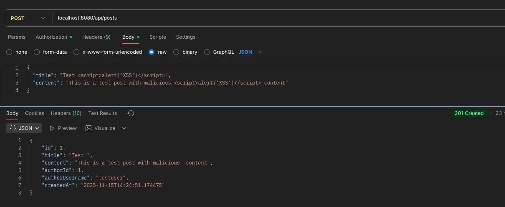
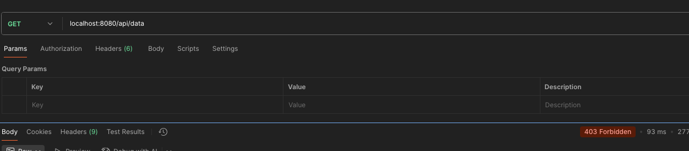
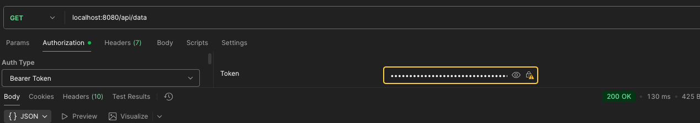
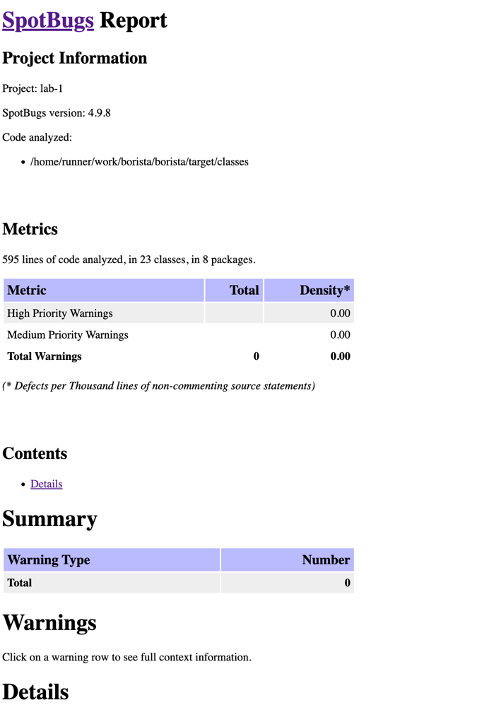

# Secure REST API with CI/CD Integration

## Описание проекта

REST API для управления постами с системой аутентификации пользователей. Реализованы базовые меры защиты от OWASP Top 10 и настроен GitHub Actions pipeline с security-сканерами (SAST и SCA).

**Технологический стек:** Java 21, Spring Boot 3.5.8-SNAPSHOT, PostgreSQL, JWT, Maven

## Описание API

### Endpoints

- `POST /auth/register` — регистрация нового пользователя
- `POST /auth/login` — аутентификация пользователя (возвращает JWT токен)
- `GET /api/data` — получение списка всех пользователей. Доступно авторизованным пользователям
- `POST /api/posts` — создание нового поста. Доступно авторизованным пользователям
- `GET /api/posts` — получение всех постов. Доступно авторизованным пользователям

### Schema

**Регистрация:**
```json
{
  "username": "user1",
  "password": "password123",
  "email": "user@example.com"
}
```

**Авторизация:**
```json
{
  "username": "user1",
  "password": "password123"
}
```

**Создание поста:**
```json
{
  "title": "Заголовок поста",
  "content": "Содержимое поста минимум 10 символов"
}
```

### Security

Доступ к /api методам есть только у авторизованных пользователей. Доступ осуществляется посредством JWT-токена.
JWT-токен передается в заголовке запроса.

## Примеры запросов

**Регистрация**
```bash
curl http://localhost:8080/auth/register \
  --header 'Content-Type: application/json' \
  --data '{
    "username": "testuser",
    "password": "password123",
    "email": "test@example.com"
  }'
```

**Авторизация**
```bash
curl http://localhost:8080/auth/login \
  --header 'Content-Type: application/json' \
  --data '{
    "username": "testuser",
    "password": "password123"
  }'
```

**Создание поста**
```bash
curl http://localhost:8080/api/posts \
  --header 'Content-Type: application/json' \
  --header 'Authorization: Bearer $API_TOKEN' \
  --data '{
    "title": "My First Post",
    "content": "This is the content of my first post"
  }'
```

**Получение постов**
```bash
curl http://localhost:8080/api/posts \
  --header 'Authorization: Bearer $API_TOKEN'
```

## Реализованные меры защиты

### Защита от SQLi

Используются параметризованные запросы через Spring Data JPA:

```java
@Repository
public interface UserRepository extends JpaRepository<User, Long> {
    @Query("SELECT u FROM User u WHERE u.username = :username")
    Optional<User> findByUsername(@Param("username") String username);
    
    boolean existsByUsername(String username);
}

@Repository
public interface PostRepository extends JpaRepository<Post, Long> {
    @Query("SELECT p FROM Post p WHERE p.authorId = :authorId ORDER BY p.createdAt DESC")
    List<Post> findByAuthorId(@Param("authorId") Long authorId);
}
```

### Защита от XSS

Пользовательские данные санитизируются с помощью OWASP Java HTML Sanitizer:

```java
private final PolicyFactory policy = Sanitizers.FORMATTING.and(Sanitizers.BLOCKS);

public PostResponse createPost(PostRequest request) {
    String sanitizedTitle = policy.sanitize(request.getTitle());
    String sanitizedContent = policy.sanitize(request.getContent());
    
    Post post = new Post();
    post.setTitle(sanitizedTitle);
    post.setContent(sanitizedContent);
    // ...
}
```

**Демонстрация защиты от XSS:**


### Как реализована аутентификация

1. Приходит запрос на регистрацию/авторизацию
2. AuthService хеширует пароль с BCrypt и сохраняет/сравнивает с базой
3. JwtUtil выписывает JWT-токен при успешной авторизации
4. Приходит запрос по /api с JWT-токеном
5. JwtAuthenticationFilter достает Authorization header и ищет Bearer схему
6. JwtUtil валидирует JWT-токен

Доступ к защищенному api только для аутентифицированных пользователей обеспечивается аннотацией @PreAuthorize:

```java
@GetMapping
@PreAuthorize("isAuthenticated()")
public ResponseEntity<List<UserResponse>> getAllUsers() {
    // ...
}
```

**Доступ без токена отсутствует:**



**Доступ по токену:**



## Отчет SAST (SpotBugs)



## Отчет SCA (OWASP Dependency-Check)


## Ссылка на последний успешный запуск pipeline
